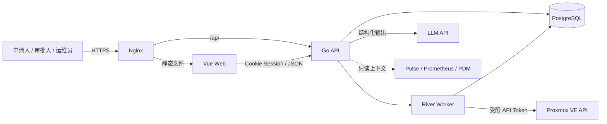

# CloudPilot-PVE 架构说明

> 状态：MVP 目标架构。仓库目前处于初始化阶段，本文描述首个可运行版本必须遵守的边界，不代表所有组件已经实现。

## 1. 目标

CloudPilot-PVE 是面向中小团队、学校实验室和私有云的 AI 原生 Proxmox VE 自助服务门户。它将自然语言资源申请转换成可预览、可审批、可审计和可恢复的确定性基础设施变更。

MVP 只打通一条黄金路径：

```text
理解需求 → 检查配额/容量 → 生成变更计划 → 人工确认/审批
→ 克隆模板 → Cloud-init → 健康验证 → 交付 → 到期回收
```

核心价值是权限、审批、配额、资源归属、有效期和审计，而不是替代 PVE 管理面板或监控系统。

## 2. 架构原则

1. **AI 只负责理解**：模型输出结构化意图，不做最终决策。
2. **确定性代码负责授权和执行**：权限、配额、容量、审批及 PVE 操作全部由 Go 完成。
3. **计划先于执行**：所有写操作先形成不可变变更计划，审批绑定具体计划。
4. **长任务持久化**：PVE 操作通过数据库任务队列执行，可恢复、可重试、可审计。
5. **最小权限**：浏览器、模型和普通用户均不能接触 PVE 凭据。
6. **单体优先**：MVP 保持一个 Go 服务和一个 PostgreSQL，避免分布式系统成本。
7. **契约驱动**：OpenAPI 是前后端接口及类型生成的唯一契约。

## 3. 系统上下文



信任边界：

- 浏览器只能访问 Nginx 暴露的静态资源和 API。
- LLM 只能接收完成意图理解所需的最少上下文。
- PVE 凭据只存在于后端运行环境中，不进入浏览器、数据库审计正文或模型上下文。
- 监控系统在 MVP 中仅提供只读上下文，不由本项目重新实现。

## 4. 技术栈

| 层级 | MVP 选择 | 说明 |
|---|---|---|
| 前端 | Vue 3、TypeScript、Vite | 表单、审批流和运维页面优先 |
| UI | Element Plus | 复用成熟表单、表格、弹窗和状态组件 |
| 路由 | Vue Router | 单页应用路由 |
| API 客户端 | `openapi-typescript`、`openapi-fetch` | 从契约生成类型，避免重复 DTO |
| 后端 | Go 最新稳定版、`net/http` | 标准库优先，不引入重型 Web 框架 |
| 日志 | `log/slog` | 结构化日志 |
| 数据库 | PostgreSQL | 事务数据、审计、任务队列统一存储 |
| 数据访问 | `pgx/v5`、`sqlc` | 显式 SQL 和类型安全生成代码 |
| 数据迁移 | Goose | 版本化迁移 |
| 后台任务 | River | 复用 PostgreSQL，不额外部署 Redis |
| API 契约 | OpenAPI 3.1 | 前后端共同事实来源 |
| AI | 单一供应商官方 Go SDK | Structured Outputs / JSON Schema |
| PVE | REST API、受限 API Token | 仅封装黄金路径所需端点 |
| 入口 | Nginx | 静态文件、TLS 和反向代理 |
| 部署 | Docker Compose 或 systemd | MVP 不使用 Kubernetes |

若团队已经统一使用 React，可以用 React + Vite 替代 Vue；除此之外不因技术潮流更换栈。

## 5. 逻辑组件

### 5.1 Web 前端

负责：

- 登录和当前身份展示。
- 自然语言申请及必要的结构化补充表单。
- 变更计划、风险和费用/配额影响预览。
- 审批操作。
- 执行进度、交付结果和审计记录展示。

不负责：

- 权限和配额的最终判断。
- 生成可信变更计划。
- 保存 PVE 或模型凭据。
- 直接调用 PVE。

执行状态在 MVP 中使用短周期轮询。只有轮询造成明确负载或体验问题时才增加 SSE；使用 SSE 时 Nginx 必须关闭该路由的代理缓冲。

### 5.2 Go API

建议保持以下边界，不创建形式化的多层框架：

```text
cmd/cloudpilot/     进程入口
internal/httpapi/   HTTP、会话、参数和响应
internal/app/       申请、审批、执行和回收用例
internal/store/     SQL 查询和事务
internal/ai/        结构化意图提取
internal/pve/       黄金路径 PVE API
internal/worker/    River 任务
api/openapi.yaml    HTTP 契约
migrations/         数据库迁移
web/                Vue 前端
```

`internal/app` 负责业务规则，HTTP handler 不直接访问 PVE。只有出现真实的第二实现时才为组件抽象接口。

### 5.3 AI 意图解析

模型输入应限制为：

- 用户原始申请文本。
- 允许用户选择的模板、规格、网络和有效期范围。
- 解析所需的少量组织术语。

模型输出是符合 JSON Schema 的结构化申请，例如资源类型、数量、模板、CPU、内存、网络、用途和有效期。输出随后必须经过 Go 代码的字段、权限、配额、容量和策略校验。

模型不得：

- 获得执行工具或 PVE Token。
- 输出并执行 Shell。
- 自行绕过审批。
- 决定调用未列入计划的 PVE API。
- 将自然语言解释结果直接当作已授权操作。

第一版只支持一个模型供应商。出现第二个已确认供应商需求后再引入适配层。

### 5.4 PVE 客户端

只实现黄金路径需要的能力：

- 查询节点、容量和模板。
- 克隆 VM/LXC。
- 设置 CPU、内存、磁盘和网络。
- 配置 Cloud-init。
- 启动实例。
- 查询 UPID 任务状态。
- 获取实例状态和交付信息。
- 到期停止和删除资源。

客户端必须验证 TLS 证书、设置超时、保留 PVE UPID，并为错误附加节点、资源和操作上下文。Token 使用项目专用最小权限角色，不使用 root 密码。

### 5.5 后台任务

创建、验证和回收不能在 HTTP 请求中同步完成。River Worker 负责：

- 执行已批准计划。
- 轮询 PVE UPID。
- 按明确策略重试瞬时错误。
- 在进程重启后恢复未完成任务。
- 发送到期提醒并触发回收。

每次执行必须有稳定幂等键。重试前先检查远端实际状态，不能假设上次调用没有生效。永久错误和达到重试上限的任务进入失败状态并等待人工处理。

## 6. 核心领域对象

MVP 预计包含以下数据对象；最终字段由对应 OpenSpec 和迁移确定。

| 对象 | 职责 |
|---|---|
| `users` | 用户身份和基础角色 |
| `resource_requests` | 申请人、用途、原始请求和结构化需求 |
| `change_plans` | 不可变的确定性执行计划及摘要 |
| `approvals` | 审批人、结果、时间和绑定的计划摘要 |
| `quotas` | 主体在 CPU、内存、存储、数量等维度的上限 |
| `executions` | 执行状态、幂等键、PVE UPID、错误和重试信息 |
| `resources` | 已交付资源、所有者、用途和到期时间 |
| `audit_events` | 追加写入的关键行为记录 |

审计记录不保存秘密或不必要的完整模型上下文。发布后的数据库迁移不可原地修改。

## 7. 状态与审批

推荐的主流程状态：

```text
申请中 → 待确认 → 待审批 → 已批准 → 已排队 → 执行中
                                      ├→ 已交付 → 待回收 → 回收中 → 已回收
                                      └→ 执行失败
```

规则：

- 每次计划生成都产生新的不可变版本和摘要。
- 审批记录绑定计划 ID 和摘要。
- 修改规格、网络、模板、数量或有效期后，旧审批立即失效。
- 只有已批准且再次通过执行前校验的计划才能入队。
- 执行前重新检查权限、配额、容量和资源冲突，避免审批后的状态变化。
- 回收前验证资源归属、平台标签和当前计划，防止误删外部资源。

## 8. API 与前端契约

`api/openapi.yaml` 是 HTTP API 唯一契约：

- Go 端生成请求/响应类型或必要绑定。
- TypeScript 端生成客户端类型。
- 生成文件不得手工修改。
- 契约变化必须与实现和调用方在同一变更中提交。
- 业务错误返回稳定错误码，前端不解析自然语言错误文本。

OpenSpec 描述需求和验收行为，OpenAPI 描述 HTTP 接口，两者不能互相替代。

## 9. 身份与安全

MVP 基础角色：

```text
applicant   申请人
approver    审批人
operator    运维管理员
```

默认使用服务端 Session 和 `HttpOnly`、`Secure`、`SameSite` Cookie，不在 `localStorage` 保存长期 JWT。所有状态变更请求必须具备 CSRF 防护。

如果组织已有 OIDC 服务，可接入现有身份提供方；不为 MVP 单独部署 Keycloak。授权仍由本系统根据身份、角色、资源归属和计划状态执行。

其他要求：

- 秘密通过运行环境或受控 secret 文件注入。
- 日志、错误和审计内容统一脱敏。
- 所有外部请求设置超时和响应大小限制。
- 生产环境不提供任意命令执行接口。
- PVE 写操作必须记录操作者、审批、计划、执行结果和远端任务标识。

## 10. 部署

推荐生产拓扑：

```text
Nginx
├── /           静态提供 web/dist
└── /api/       反向代理 Go API

Go Service
├── HTTP API
└── River Worker

PostgreSQL
```

Nginx 负责 TLS、静态文件和反向代理。证书由 Certbot、企业证书平台或上层负载均衡管理。开发环境由 Vite 代理 `/api`，避免在应用中维护两套 CORS 策略。

MVP 使用 Docker Compose 或 systemd。只有出现多实例调度、自动扩缩容或组织统一平台的真实需求时才考虑 Kubernetes。

## 11. 可观测性

第一版保持最小集合：

- `slog` JSON 结构化日志。
- 请求 ID、申请 ID、计划 ID、执行 ID 和 PVE UPID 关联字段。
- 健康检查和就绪检查。
- 任务成功、失败、重试和耗时指标。
- 审计事件与运行日志分离。

不自研时序监控和完整仪表盘。需要深度监控时接入 Pulse、Prometheus/Grafana 或 PDM。

## 12. 明确不做

MVP 不实现：

- 多集群。
- 任意 PVE API 控制台。
- 任意命令执行和 SSH 通道。
- 自主故障修复。
- 多模型市场或 Agent 插件系统。
- 自研监控平台。
- 微服务、消息总线和 Kubernetes。
- 手机 App。

## 13. 演进触发条件

只有出现可测量需求时才升级：

| 当前方案 | 升级条件 |
|---|---|
| 状态轮询 | 明确的延迟或请求量问题，再增加 SSE |
| 单模型 SDK | 第二个模型供应商成为已批准需求 |
| 单 Go 服务 | 独立扩缩容、故障域或团队边界已形成 |
| PostgreSQL + River | 数据库队列成为经测量的吞吐瓶颈 |
| Docker Compose/systemd | 组织平台或多实例调度成为硬要求 |
| 单集群 | 单集群黄金路径稳定且多集群需求获批 |
